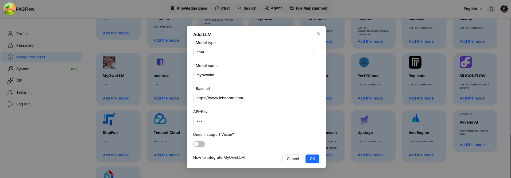
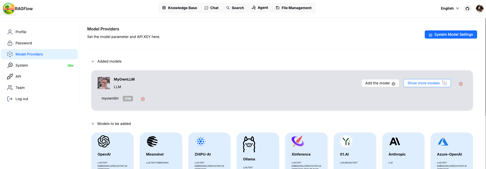
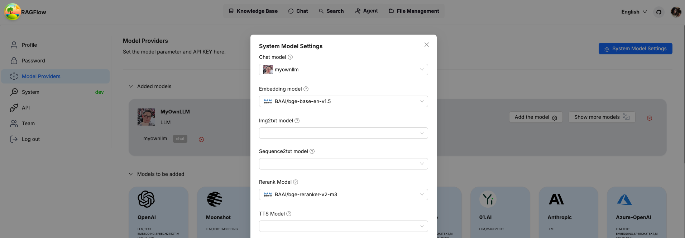
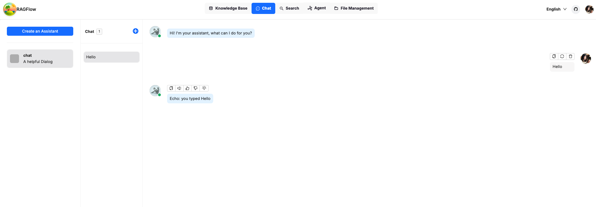

# Guide of adding your own LLM to RAGFlow

## 1. follow the guide to lauch ragflow from source code.

https://ragflow.io/docs/dev/launch_ragflow_from_source

## 2. add a LLM logo for frontend

- add your logo svg to ``web/src/assets/svg/llm`(for example: `web/src/assets/svg/llm/myownllm.svg`)
- link the svg to the LLM factory by adding an entry in [`web/src/constants/setting.ts`](https://github.com/6chaoran/ragflow/blob/4c5f5a0e393cf93e4ac84e9c0cd12e50b3e002c6/web/src/constants/setting.ts#L24C1-L25C1).

```javascript
export const IconMap = {
  MyOwnLLM: 'myownllm', // [MyOwnLLM] logo filename
  'Tongyi-Qianwen': 'tongyi',
  //...
}
```


## 3. add your LLM into `LocalLLMFactories` for frontend

- add an entry to register in `LocalLlmFactories` in `web/src/pages/user-setting/constants.tsx`

```js
export const LocalLlmFactories = [
  'MyOwnLLM', //[MyOwnLLM]
  'Ollama',
  'Xinference',
  'LocalAI',
]
```

- add an entry to `optionsMap` in `web/src/pages/user-setting/setting-model/ollama-modal/index.tsx`

```js
const optionsMap = {
    MyOwnLLM: [
      // [MyOwnLLM]
      { value: 'chat', label: 'chat' },
    ],
    HuggingFace: [
      { value: 'embedding', label: 'embedding' },
      { value: 'chat', label: 'chat' },]
    // ...
}   
```

## 4. add your LLM info into `factory_llm_infos` in `conf/llm_factories.json`

```json
{
    "factory_llm_infos": [
        {
            "name": "MyOwnLLM",
            "logo": "",
            "tags": "LLM",
            "status": "1",
            "llm": [
                {
                    "llm_name": "myownllm",
                    "tags": "LLM,CHAT,128K",
                    "max_tokens": 128000,
                    "model_type": "chat"
                }]
        },]
    //...
}
```

## 5. pass `llm_name` and `api_key` of your LLM to method `add_llm` in `api/apps/llm_app.py`

This is not important if `api_key` is not used in your own LLM.

```py
def add_llm():
    # ....
    elif factory == "MyOwnLLM": #[MyOwnLLM]
        print("setting myownllm")
        print(req)
        llm_name = req["llm_name"]
        api_key = req["api_key"]
    # ...
```

## 6. register your LLM in `rag/llm`

* `rag/llm/__init__.py`

```python
ChatModel = {
    "MyOwnLLM": MyOwnLLM,
    # ...
}
```

* `rag/llm/chat_model.py` 

If you want to add a chat model. add a new class `MyOwnLLM` to define your own LLM.
In the following example, I defined simple echo LLM for `chat` and `chat_streamly` methods.
Here I only add LLM for chat model. The same applies for other models.

```python
class MyOwnLLM(Base): # [MyOwnLLM]
    def __init__(self, key, model_name, base_url):
        self.client = None
        self.model_name = model_name
        self.api_key = key
        self.base_url = base_url

    def chat(self, system, history, gen_conf):
        prompt = history[-1]['content']
        response = "Echo: you typed " + prompt
        token_usage = len(prompt + response)
        return response, token_usage
    
    def chat_streamly(self, system, history, gen_conf):
        prompt = history[-1]['content']
        response = "Echo: you typed " + prompt
        ans = ""
        for i in response:
            ans += i
            yield ans
        token_usage = len(prompt + response)
        yield token_usage
```

## 7. start the backend

```sh
bash docker/entrypoint.sh
```

## 8. start the frontend

In a another terminal, launch the frontend

```sh
cd web
npm run dev
```

If everything is set up correctly, you should see your own LLM added to the list of LLM options
Enable your own LLM by passing `api_key`, `model_name`, which can be anything if you are not using them for your own LLM.



After confirmation, you will see your own LLM is added and ready for use.



Set your own LLM as system wide LLM and you are ready to go.



Let's go to `chat` to send a simple prompt to test it out. As you can see, the bot responded the same message we sent, as expected.



Congrationations, you can play around with `RAGFlow` fully offline safely !